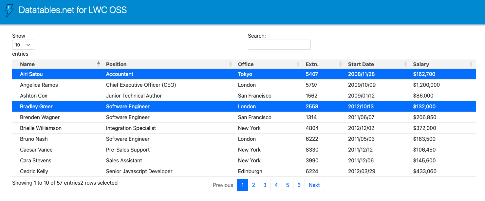

# lwc-oss-datatable - Datatables.net for LWC OSS (off Salesforce platform)

## 1. Introduction

This demonstrates the use of Datatables.net (https://datatables.net) in the context of the simplest Node web app based on LWC OSS (Lightning Web Componente Open Source - see lwc.dev)

## 2. LWC Ligthning Web Component

The `index.js`, `index.html`, `app/*` files are part of the standard LWC app scaffolding.
`index.js` imports LWC synthetic shadow for LWC OSS (off Salesforce platform) :

```
// index.js

import "@lwc/synthetic-shadow"
```

`app.html` loads the demo component `baseTable` :

```
<!-- app.html -->

<my-base-table></my-base-table>
```

The Lightning SLDS (Salesforce Lightning Design System) CSS styling resources are loaded in the `header` section of `index.html` in `src/client/index.html` :

```
<!-- index.html -->

<!-- SLDS -->
<link rel="stylesheet" type="text/css" href="/slds/styles/salesforce-lightning-design-system.min.css" />
```

## 3. LWC component for Datatables

### 3.1 Javascript

The demo component is `baseTable` in `src/client/modules/my/baseTable`.
It imports its own `jQuery` and `Datatables.net` npm modules with :

```
// baseTable.js

import $ from "jquery"
import "datatables.net-select-bs5"
```

It loads its own demo data :

```
// baseTable.js

import DATA from "./data.json"
```

### 3.2 HTML

The `table` element is assigned the `lwc:dom="manual"` attribute :

```
<!-- baseTable.html -->

<template>
  <table lwc:dom="manual" class="tableCls slds-table slds-table_cell-buffer slds-table_bordered" style="width: 100%"></table>
</template>
```

see https://developer.salesforce.com/docs/component-library/documentation/en/lwc/reference_directives

### 3.3 Datatables CSS styling resources

The Datatables.net CSS files are imported globally in `index.html`, after the Lightning SLDS resources :

```
// index.html

<!-- Datatables.net - Bootstrap 5 & Select -->
<link rel="stylesheet" type="text/css" href="https://cdn.datatables.net/1.13.2/css/dataTables.bootstrap5.min.css" />
<link rel="stylesheet" type="text/css" href="https://cdn.datatables.net/select/1.6.0/css/select.dataTables.min.css" />
```

### 3.4 Datatables initialisation

```
initTable() {
  // Table
  let table = this.template.querySelector("table")
  this.oDataTable = $(table).DataTable({
    data: this.data,
    columns: this.columns,
    select: true,
  })

  // Display the table
  this.oDataTable.draw()

  // DEBUG Select
  console.log("### select()")
  this.oDataTable.row(":eq(0)", { page: "current" }).select()
  this.oDataTable.row(":eq(3)", { page: "current" }).select()
}
```



The result is as expected : lines 1 and 4 are selected.

Unfortunately, trying to select lines manually (with the mouse) fails.
This is probably due to the way events are managed by Datatables, and how they are propagated in the LWC synthetic DOM. I have not managed to understand this correctly yet, but it is documented here :

- https://developer.salesforce.com/docs/component-library/documentation/en/lwc/create_light_dom
- https://developer.salesforce.com/docs/component-library/documentation/en/lwc/lwc.get_started_oss

We are working with LWC OSS, off the Salesforce platform.

## 4. Installation

```
% yarn install
% yarn watch:client
```

and open a browser at http://localhost:3001
